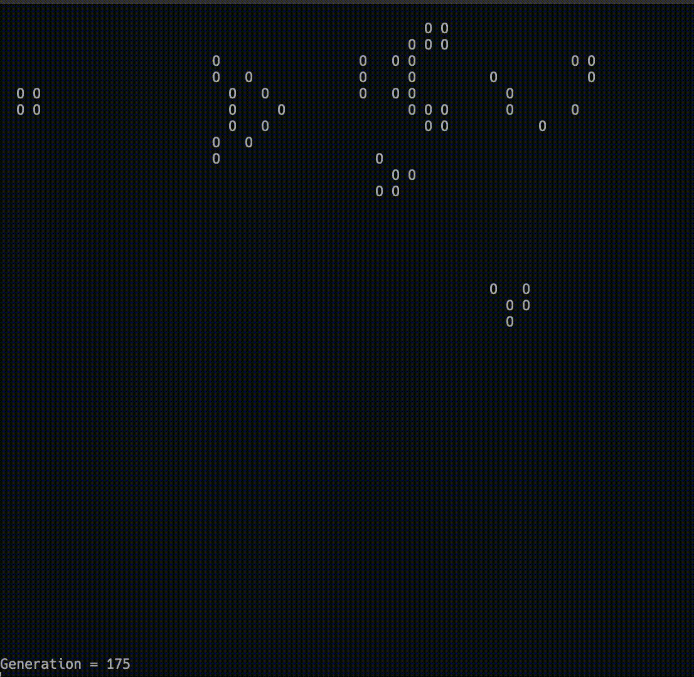

# GOL-C
Conway's Game of Life terminal application.



## To install:
```console
$ make
```

## To run:

```console
$ ./GOL.c {optional arguements}
```

## Possible Optional Arguements
To pass an optional arguement when running GOL-C, simply add the arguement when running the above.

```console
-e {Number of evolutions e.g 100} (Number of steps to evolve for (default 100))
-t {Time between evolutions e.g 1} (Number of seconds between each evolution (default 0))
-s {Random seed value e.g 100} (The random seed to use to generate the initial cells (default 1))
-g (whether to set the initial state as a glider gun)
```

## Additional Notes
Conway's Game of Life is a well known problem in the area of cellular automata.

It was shown to be Turing Complete (meaning it can simulate any Turing Machine) when Paul Rendenll built a Turing Machine using a pre-defined board state in 2001.

By regarding Gliders as 'bits' and a collection of patterns (glider guns, glider eaters and more), it's possible to emulate logic gates and memory latches. Try running the application in this repository with the *-g* option to see a glider gun in action!
